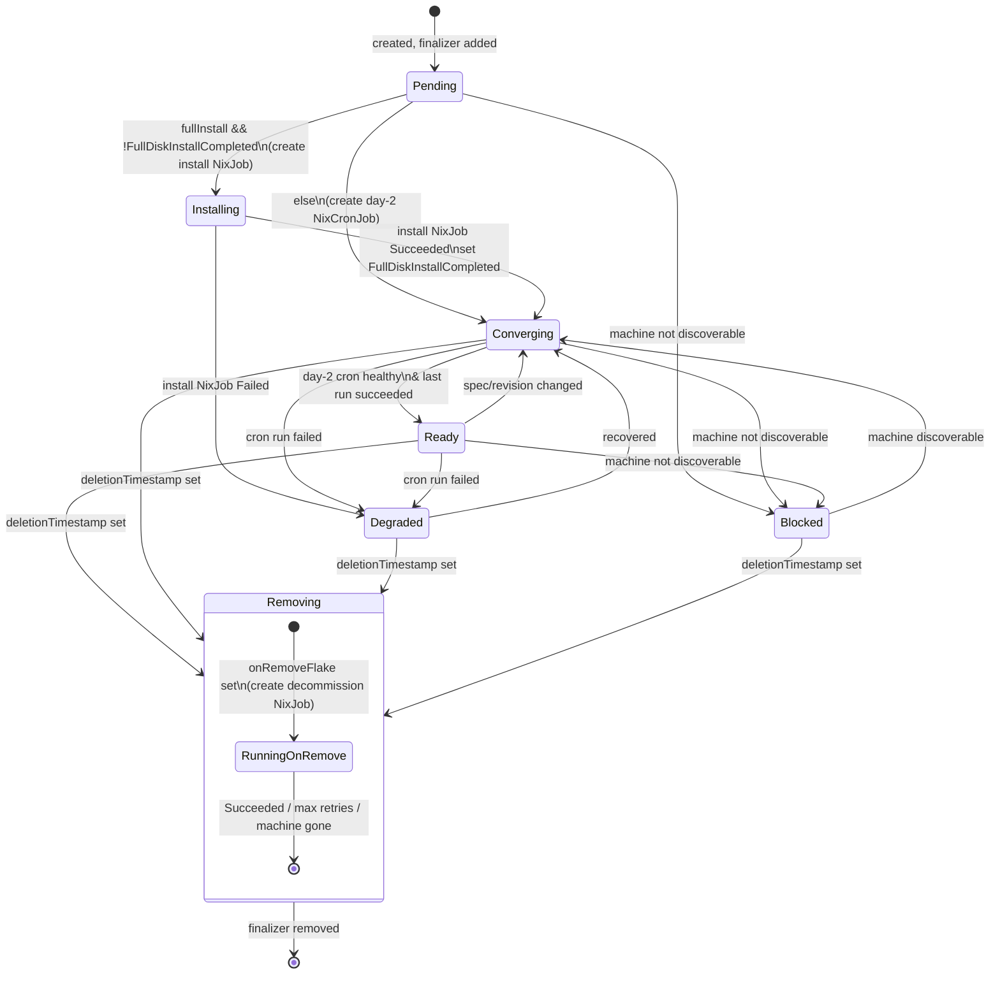

# NixosConfiguration v1alpha2 — orchestrator state machine

## Context

`NixosConfiguration` (v1alpha1) carries its own hand-written apply machinery:
it builds a `batch/v1` Job, mounts the machine SSH key, polls the Job every
10s (`monitorJob`), enforces `MaxConcurrentJobs`, and re-implements git fetch +
`nixos-rebuild`/`nixos-anywhere` inside `internal/applyjob`. This duplicates
logic that the Nix workload family (`NixJob`, `NixCronJob`) already does.

> **Status update (PRs #13–#15 merged).** v1alpha1 is now *correct*, not just
> present: it resolves the ref to an immutable SHA and stores it in
> `status.appliedCommit` (same-branch drift is detected), delivers inline
> `additionalFiles` and force-stages them so Nix actually sees them,
> authenticates private repos (shared `internal/gitauth`) in both resolution
> and clone, and fetches the exact resolved SHA in the Job (no TOCTOU). So the
> v1alpha2 motivation is **no longer "fix drift detection"** — that is done.
> The motivation is: (a) delete the duplicated apply machinery and reuse the
> workload family (which independently does SHA resolution, Flux, fetch-by-SHA,
> deterministic job names, and run-history GC); and (b) model the machine
> lifecycle as an explicit, status-visible state machine.
>
> **Critical carry-over:** the workload family does **not** yet have the
> capabilities v1alpha1 just gained — private-repo credentials in its resolver
> and inline-file injection — nor any cross-resource concurrency control. The
> rewrite must not regress these; see "Gaps / must-add before implementation".

This document proposes rewriting `NixosConfiguration` as a **v1alpha2
orchestrator**: it stops applying anything itself and instead drives a small
**state machine** that composes child workload resources:

1. a one-shot **`NixJob`** for the initial full-disk install (`nixos-anywhere`);
2. a recurring **`NixCronJob`** for day-2 convergence (`nixos-rebuild switch`);
3. a one-shot **`NixJob`** for decommission (`onRemoveFlake`).

The state machine and every child are tracked in `status`.

## Goals

- Delete the bespoke Job/apply machinery in `nixosconfiguration_controller.go`
  and `internal/applyjob`; reuse the workload family instead.
- Inherit correct, SHA-based revision resolution and Flux integration for free.
- Model the machine lifecycle (install → day-2 → decommission) as an explicit,
  status-visible state machine.
- Keep machine-plane policy (discoverability gating, per-machine serialization)
  in the orchestrator — the workload family has no concept of it.

## Non-goals

- No change to `Machine` semantics or discoverability logic.
- No change to how `NixJob`/`NixCronJob` build and run in-cluster (only an
  additive "apply to a remote host" capability — see Key decision 1).
- Event-based node-level drift detection stays out of scope (roadmap).

## Vocabulary

- **Orchestrator** — the v1alpha2 `NixosConfiguration` controller. Owns no Jobs
  directly; owns child `NixJob`/`NixCronJob` resources.
- **Child** — a `NixJob` or `NixCronJob` created and owned (ownerRef) by a
  `NixosConfiguration`, except the decommission child (see Key decision 3).

## State machine

`status.phase` is the single coarse state. Transitions are driven by child
status and by `Machine.status.discoverable`.



### Phases (`status.phase`)

| Phase | Meaning | Child in flight |
| --- | --- | --- |
| `Pending` | Finalizer added; resolving machine + revision | none yet |
| `Blocked` | Target `Machine` not discoverable; waiting | day-2 cron suspended |
| `Installing` | First-boot `nixos-anywhere` running | install `NixJob` |
| `Converging` | Day-2 cron created/updated; not yet confirmed healthy | day-2 `NixCronJob` |
| `Ready` | Day-2 cron healthy, last apply succeeded | day-2 `NixCronJob` |
| `Degraded` | A child run failed (install or day-2) | install or day-2 |
| `Removing` | Deletion requested; running `onRemoveFlake` | decommission `NixJob` |

### Transition rules

1. **create → `Pending`**: add `FinalizerName`, record `targetMachine`.
2. **`Pending` gate**: if target `Machine` missing or `!discoverable` →
   `Blocked` (requeue). Else resolve revision. This gate applies from **any**
   active phase: a `Ready`/`Converging` config whose `Machine` later becomes
   undiscoverable transitions to `Blocked` and its day-2 cron is suspended.
3. **`Pending` → `Installing`** when `spec.fullInstall &&
   !status.fullDiskInstallCompleted`: create the install `NixJob`.
4. **`Pending` → `Converging`** otherwise: create/update the day-2 `NixCronJob`.
5. **`Installing` → `Converging`** when the install `NixJob` reaches
   `status.succeeded > 0`: set `status.fullDiskInstallCompleted = true`,
   delete the install child, create the day-2 `NixCronJob`.
6. **`Installing` → `Degraded`** on install `NixJob` `failed > 0` (bounded
   retry, then hold in `Degraded`).
7. **`Converging` → `Ready`** when the day-2 `NixCronJob` reports
   `status.lastSuccessfulTime` for the current resolved revision and no active
   failing job.
8. **`Ready`/`Converging` → `Degraded`** when the cron's most recent job
   failed; back to `Converging`/`Ready` on recovery.
9. **any → `Removing`** when `deletionTimestamp` is set: suspend/delete the
   day-2 cron, then (if `onRemoveFlake` set and machine discoverable) create the
   decommission `NixJob`.
10. **`Removing` → done** when the decommission `NixJob` succeeds, or retries
    exhaust (`MaxOnRemoveRetries`), or the machine is gone: remove the
    finalizer.

## Status schema (v1alpha2)

`status.phase` plus the existing kstatus conditions (`Ready`, `Reconciling`,
`Stalled`) and the NixosConfiguration-specific `Applied`, `GitSynced`, derived
from child status. New/kept fields:

```go
type NixosConfigurationStatus struct {
    ObservedGeneration       int64        `json:"observedGeneration,omitempty"`
    Phase                    string       `json:"phase,omitempty"`         // state machine
    FullDiskInstallCompleted bool         `json:"fullDiskInstallCompleted,omitempty"`
    ResolvedRevision         string       `json:"resolvedRevision,omitempty"` // real git SHA (from child)
    LastAppliedTime          *metav1.Time `json:"lastAppliedTime,omitempty"`
    TargetMachine            string       `json:"targetMachine,omitempty"`

    // Child references — the state machine's working set.
    InstallJobRef      string `json:"installJobRef,omitempty"`      // NixJob name
    DayTwoCronJobRef   string `json:"dayTwoCronJobRef,omitempty"`   // NixCronJob name
    DecommissionJobRef string `json:"decommissionJobRef,omitempty"` // NixJob name
    InstallRetries     int32  `json:"installRetries,omitempty"`     // bounds Installing retry
    OnRemoveRetries    int32  `json:"onRemoveRetries,omitempty"`

    Conditions []metav1.Condition `json:"conditions,omitempty"`
}
```

Dropped from v1alpha1: `operationState`, `configurationHash`,
`additionalFilesHash`, `appliedCommit` (replaced by `resolvedRevision`, sourced
from the child's `status.rolledOutRevision`). Condition mapping:

- `GitSynced` ← child `GitSynced` (revision resolved & fetched).
- `Applied` ← install child succeeded (bootstrap) and/or day-2 cron
  `lastSuccessfulTime` present for the current revision.
- `Ready` ← `phase == Ready`.
- `Stalled` ← `phase == Degraded` or `Blocked`.

## How each child is constructed

The apply is expressed through the workload `nix run <Run> -- <Args>` model
(confirmed in `nixworkload_common_types.go`: `Run` is "the installable exactly
as typed after `nix run`"; `Args` follow `--`). The source repo is fetched by
the child's `fetch-source` init container into the workspace, and the flake is
referenced relative to it.

| Child | `Nix.Run` | `Nix.Args` | Cardinality |
| --- | --- | --- | --- |
| Install | `github:nix-community/nixos-anywhere` | `--flake .#<attr> root@<host>` | one-shot `NixJob` |
| Day-2 | `nixpkgs#nixos-rebuild` | `switch --flake .#<attr> --target-host root@<host>` | recurring `NixCronJob` |
| Decommission | `nixpkgs#nixos-rebuild` | `switch --flake .#<onRemoveAttr> --target-host root@<host>` | one-shot `NixJob` |

`Nix.Source` is filled from `spec.gitRepo`/`spec.ref`/`spec.credentialsRef`
(or a future `fluxSourceRef`). Build acceleration (`storeRef`/`builderRef`) is
passed through if the orchestrator's spec sets it.

## Key decisions (recommended)

### 1. SSH-to-target-host: NO `NixTarget` — the orchestrator injects it from the `Machine`

**Decision (revised): there is NO `NixTarget` field.** The target's host, user,
and SSH key already live in the `Machine` (`spec.host` / `spec.sshUser` /
`spec.sshKeySecretRef`, key `ssh-privatekey`) that `machineRef` points at.
Adding a `NixTarget{Host,User,SSHKeyRef,…}` to the generic `NixSpec` would just
duplicate `Machine`, and would couple the workload family to a
NixosConfiguration concept. It is not needed.

Instead, the **orchestrator injects target SSH into the child's template**,
sourced from the `Machine`, when it builds the install/day-2/decommission child:

- mount the `Machine`'s SSH-key Secret as a pod volume;
- set `NIX_SSHOPTS` (`-i <mounted-key> …`) on the app container;
- put `--target-host <user>@<host>` in `Nix.Args` (the normal workload path).

This is safe because `nixrender.go` **preserves** user-set fields on the
operator-owned app container: `findOrNewContainer` deep-copies the existing
container, and `upsertEnv`/`upsertMounts`/`upsertVolume` add-or-replace by key
without dropping the injected env/mounts/volumes (verified). The one render
change needed (and landed on `feat/workload-additional-files`): **the app is
wrapped in `nix shell nixpkgs#openssh` whenever `NIX_SSHOPTS` is present** (the
nix image has no ssh), not only when a builder is used.

**`NIX_SSHOPTS` policy — broad/permissive by decision.** Use
`-o StrictHostKeyChecking=no -o UserKnownHostsFile=/dev/null` (same as the
builder path). **No host-key pinning, no `known_hosts`, no new `Machine` field.**
This is a deliberate convenience-over-MITM-hardening tradeoff chosen for
v1alpha2; it can be tightened later by adding an optional host-key source to the
`Machine` (e.g. populated via `ssh-keyscan` during discovery) without touching
the workload family.

Builder + target on the same child is out of scope (a build-host apply does not
also delegate to a remote builder — see Open question 4); that avoids the single
`NIX_SSHOPTS` serving two different keys.

### 2. Day-2 is a `NixCronJob` (periodic self-heal), not on-change only

Periodic re-apply restores node-level drift that git never sees (someone
stopped a service by hand). That is the current self-heal behavior and it maps
to a cron. On-change convergence is *also* wanted, and `NixSpec.triggerOnChange`
already gives it (a new resolved revision rolls the cron's jobTemplate). So the
day-2 child is a `NixCronJob` with `triggerOnChange: true` and a schedule from a
new `spec.dayTwoSchedule` (default e.g. `*/30 * * * *`). This is a superset of
both models.

`concurrencyPolicy: Forbid` is **mandatory**, not optional: two overlapping
`nixos-rebuild switch` runs against the same host corrupt the system. This is
already safe in the workload family — `NixCronJob` honors `ForbidConcurrent`
both on the schedule and on the `triggerOnChange` immediate fire (it skips the
immediate Job while one is active), so an on-revision-change apply is prompt
(no waiting for the next tick) yet serialized. Note this only serializes runs
*within one cron*; it does **not** prevent two different `NixosConfiguration`s
from applying to the same machine — see Gap 4.

### 3. The decommission `NixJob` must survive parent deletion

If the decommission child is owned by the `NixosConfiguration`, the ownerRef
cascade deletes it the moment the parent is deleted — before it can run. So the
decommission `NixJob` is created **without** an ownerRef (orphan), labeled for
discovery, and self-cleans (`ttlSecondsAfterFinished`). The orchestrator holds
its finalizer until that Job succeeds / exhausts retries / the machine is gone,
then removes the finalizer. This preserves the existing `MaxOnRemoveRetries`
semantics, just relocated.

### 4. Ship as v1alpha2 with a conversion webhook; v1alpha1 stays as spoke

Only `v1alpha1` exists today and there is no conversion machinery. Introduce
`api/v1alpha2` for `NixosConfiguration`, mark **v1alpha2 as the hub** (storage
version), and write a conversion from v1alpha1 (spoke). Fields that no longer
exist (`operationState`, hashes) are dropped on convert; `appliedCommit` maps
**cleanly** to `resolvedRevision` — both are now real commit SHAs (v1alpha1
stores the resolved SHA since PR #13), so this is a straight copy, not the
lossy "best-effort" it would have been against the old ref-name value.
Kubebuilder scaffolds this via `kubebuilder create webhook ... --conversion`;
the `Machine` and workload CRDs stay v1alpha1.

## Reconcile flow (orchestrator, pseudocode)

```text
Reconcile(cfg):
  if cfg.deletionTimestamp != nil:
      return reconcileRemoving(cfg)        # phase = Removing
  ensureFinalizer(cfg)

  machine = get(cfg.spec.machineRef)
  if machine == nil or !machine.status.discoverable:
      setPhase(Blocked); suspend(dayTwoCron?); requeue

  if cfg.spec.fullInstall and !cfg.status.fullDiskInstallCompleted:
      job = ensureInstallNixJob(cfg, machine)   # phase = Installing
      switch job.status:
        Succeeded: cfg.status.fullDiskInstallCompleted = true; delete(job)
        Failed:    setPhase(Degraded); requeue
        else:      setPhase(Installing); requeue

  cron = ensureDayTwoNixCronJob(cfg, machine)   # phase = Converging
  cfg.status.resolvedRevision = cron.status.rolledOutRevision
  if cron healthy and lastSuccessfulTime for current revision:
      setPhase(Ready)
  elif cron last job failed:
      setPhase(Degraded)
  else:
      setPhase(Converging)
  aggregateConditions(cfg, cron); requeue(RequeueAfter)

reconcileRemoving(cfg):
  suspendOrDelete(dayTwoCron)
  if cfg.spec.onRemoveFlake == "" or machine gone:
      removeFinalizer(cfg); return
  job = ensureDecommissionNixJob(cfg, machine)  # orphan, no ownerRef
  switch job.status:
    Succeeded:                 removeFinalizer(cfg)
    Failed & retries exhausted: removeFinalizer(cfg) (warn event)
    else:                      setPhase(Removing); requeue
```

## Controller wiring

```go
For(&niov1alpha2.NixosConfiguration{}).
  Owns(&niov1alpha1.NixJob{}).        // install child
  Owns(&niov1alpha1.NixCronJob{}).    // day-2 child
  Watches(&niov1alpha1.Machine{}, findConfigsForMachine).
  // decommission NixJob is orphaned → discovered by label, watched via Watches
  Watches(&niov1alpha1.NixJob{}, findConfigsForOrphanRemoveJob)
```

## Files touched

- `api/v1alpha2/nixosconfiguration_types.go` — new spec (`target`,
  `dayTwoSchedule`, keep `machineRef`/`gitRepo`/`ref`/`flake`/`fullInstall`/
  `onRemoveFlake`/`credentialsRef`/`additionalFiles`/`configurationSubdir`) +
  new status. **`configurationSubdir` must be kept** (v1alpha1 parity, Gap 5) —
  the orchestrator maps it onto the child's `Nix.Source.Dir` (flake-in-subdir).
- `api/v1alpha1/nixosconfiguration_conversion.go` — spoke conversion.
- `api/v1alpha1/nixworkload_common_types.go` — no `NixTarget` (Key decision 1):
  target SSH is injected from the `Machine` by the orchestrator, not a spec field.
  ✅ `additionalFiles` and `Source.Dir` (subdir) already added.
- `internal/controller/nixrender.go` — ✅ done: openssh-wrap when `NIX_SSHOPTS`
  is present (Key decision 1); inline-file injection with `git add --force`
  (Gap 2); honor `Source.Dir` (Gap 5).
- `internal/controller/nixresolve.go` — pass `Source.credentialsRef` to
  `LsRemote` via `internal/gitauth` instead of `nil` (Gap 1).
- `internal/controller/nixosconfiguration_controller.go` — rewrite as the state
  machine; delete `createApplyJob`/`monitorJob`/`applyOnRemoveFlake` and the
  `internal/applyjob` dependency (retire the package once nothing imports it);
  implement per-machine serialization + global cap (Gaps 3–4).
- `config/crd`, `config/webhook`, `config/rbac`, `PROJECT` — regenerate
  (`make manifests generate`); add conversion webhook and orchestrator RBAC for
  `nixjobs`/`nixcronjobs` + `machines`.

## Verification

1. `make generate manifests` — deepcopy + CRDs regenerate clean; conversion
   webhook wired.
2. Unit (envtest, `internal/controller`): drive the state machine with a fake
   client —
   - `fullInstall` path: `Pending → Installing → Converging → Ready`, install
     `NixJob` created then deleted, `fullDiskInstallCompleted` set.
   - non-install path: `Pending → Converging → Ready`, `NixCronJob` created.
   - not-discoverable → `Blocked`, cron suspended.
   - deletion with `onRemoveFlake`: `Removing`, orphan decommission `NixJob`
     created (no ownerRef), finalizer removed on its success.
   - deletion without `onRemoveFlake`: finalizer removed immediately.
3. Child-construction unit tests: assert the `NixJob`/`NixCronJob` built for
   each state carry the expected `Nix.Run`/`Nix.Args`/`Nix.Target` and source.
4. Conversion round-trip test: v1alpha1 ⇄ v1alpha2 for a representative object.
5. E2E (Kind, existing `test/e2e`): create a v1alpha2 `NixosConfiguration`
   against a reachable test host, assert phase reaches `Ready` and the day-2
   `NixCronJob` exists.

## Gaps / must-add before implementation

Cross-checked against the v1alpha1 fixes (PRs #13–#15) and the actual workload
code. Ordered by priority.

### Blockers — these regress working v1alpha1 behavior or break prod

**Gap 1 — Private-repo credentials in the workload family. ✅ DONE**
(branch `feat/workload-private-repo-creds`). The plan assumes
SHA resolution and clone come "for free" from the workload family, but they are
credential-less today: `resolveRevision` calls `git.LsRemote(ctx, repo, ref,
nil)` (`nixresolve.go`), and the pod's `fetch-source` init clones without auth.
A private-repo `NixosConfiguration` in v1alpha2 would fail at resolution and at
clone. Wire `Nix.Source.credentialsRef` through the workload resolver *and* the
`fetch-source` script using the shared `internal/gitauth` (SSH via
`GIT_SSH_COMMAND`, HTTPS via `GIT_ASKPASS`), with the same secret-key convention
(`ssh-privatekey` / `known_hosts` / `username` / `password` / `token`, trimmed).
This is the deferred follow-up from the v1alpha1 work; it is now a **prerequisite**.

**Gap 2 — `additionalFiles` as a workload feature, carrying every PR #15
lesson. ✅ DONE** (branch `feat/workload-additional-files`). Implemented as an
`inject-files` init-container (between fetch-source and instantiate):
- writes files after checkout, before build;
- stages with `git add --force -- <exact paths>` (never `git add --all`; Nix
  copies only tracked/staged files from a git-tree flake source);
- writes into the `/workspace` checkout (writable emptyDir);
- validates `Path` (relative, no traversal, safe charset) in the reconcile path
  → stall on a bad value;
- source is one of `inline` / `configMapRef` / `secretRef` (CEL one-of).
  **`SecretRef` is now supported** (sensitive content stays a Secret). **Inline
  goes through an operator-owned `<workload>-nixfiles` ConfigMap**, not the pod
  spec, so large content does not bloat every pod. `NixosFacter` is **deferred**
  (never worked in v1alpha1 — not a regression).

**Gap 3 — Per-machine serialization has no mechanism.** Listed as a goal, but
the workload family has **no** cross-resource concurrency control (only each
`CronJob`'s native `concurrencyPolicy`, which is per-cron). Two
`NixosConfiguration`s targeting one `Machine` → two day-2 crons → concurrent
`nixos-rebuild` on one host = corruption. And the orchestrator does not control
when a cron fires, so it cannot gate each run. Options: (a) admission/uniqueness
validation forbidding >1 config per `Machine`; (b) a machine-level lease the
orchestrator holds and each apply gates on. Must be designed explicitly — it is
*harder* here than in v1alpha1, which gated on an active-Job check per machine.

**Gap 4 — Global apply cap is lost.** v1alpha1 caps concurrent applies at
`MaxConcurrentJobs = 5`. With one day-2 cron per config firing independently,
N configs → N simultaneous `nixos-rebuild` (thundering herd). Either keep a
global throttle in the orchestrator or consciously drop it and record why.

**Gap 5 — `configurationSubdir` (flake-in-subdir). ✅ DONE**
(branch `feat/workload-additional-files`). v1alpha1 has a `configurationSubdir`
spec field; the workload's `Nix.Source.Dir` was declared but never wired (dead
field). Now honored: when `Source.Dir` is set, the instantiate and app
containers run with their working directory at that subdir of the checkout, so
a relative installable (`.#attr`) resolves against it while fetch-source still
clones the repo root (Dir is validated: relative, no traversal). The
orchestrator maps `configurationSubdir` → child `Nix.Source.Dir`. **Do not drop
`configurationSubdir` from the v1alpha2 spec.**

**Gap 6 — Machine status writeback is lost.** v1alpha1's `handleJobSuccess`
writes `Machine.status.{hasConfiguration, appliedConfiguration, appliedCommit,
lastAppliedTime}` on a successful apply — visible via `kubectl get machine` and
used as a `needsApply` trigger ("machine configuration mismatch"). The v1alpha2
status schema and reconcile pseudocode **omit this**. The orchestrator MUST
write it back on install/day-2 success — it owns the Machine relationship, and
without it the Machine has no record of what config/commit it runs. Sources:
`appliedCommit`/`resolvedRevision` from the child's `status.rolledOutRevision`;
`lastAppliedTime` from the child cron's `status.lastSuccessfulTime`. Needs
`machines/status` RBAC (already in the orchestrator's listed markers).

### Spec / status / state-machine additions

- **Target SSH from the `Machine`, permissive `NIX_SSHOPTS`** (Key decision 1,
  revised): no `NixTarget`; `StrictHostKeyChecking=no` is accepted for v1alpha2
  (no host-key pinning) as a deliberate convenience tradeoff.
- **`concurrencyPolicy: Forbid`** mandatory on the day-2 cron (Key decision 2,
  updated).
- **`status.installRetries`** to bound the `Installing` retry (rule 6 says
  "bounded retry" but had no counter).
- **`Ready → Blocked`** transition when a `Machine` goes undiscoverable while
  `Ready` (added to the diagram and rules).
- **Spec change during `Installing`** — define behavior (editing the flake while
  the full-disk install `NixJob` runs).

### Behavior differences from v1alpha1 (accept & document, not blockers)

- **Re-apply trigger scope.** v1alpha1 re-applies immediately on any change to
  its config hash (`gitRepo`+`ref`+`flake`+`configurationSubdir`+`fullInstall`+
  inline `additionalFiles`). The day-2 `NixCronJob` re-rolls only on its
  `compositeRevision` = hash(`resolvedRevision`, `run`, `args`): a git-rev /
  flake / target change re-rolls immediately, but a change to `additionalFiles`
  **content** (ConfigMap/Secret) has no immediate trigger — it is picked up on
  the next scheduled run (each run re-fetches and re-injects current content).
  Self-heal still converges; only the latency differs. If immediate convergence
  on file changes is required, the orchestrator must fold a file-content hash
  into the child's rollout key.
- **`JobPending` stall.** v1alpha1 stalls an apply Job stuck Pending > 5m
  (`Stalled/JobPending`). The workload family has no equivalent explicit stall;
  a stuck child surfaces only as `Progressing`. Minor observability loss —
  consider surfacing it from the orchestrator.

### Operational

- **RBAC markers** for the orchestrator: `create;get;list;watch` on
  `nixjobs`/`nixcronjobs` (not `batch/jobs` directly) plus `watch` on
  `machines`; regenerate.
- **Decommission orphan races:** (a) after an operator restart between creating
  the orphan `NixJob` and recording `decommissionJobRef`, discover it
  idempotently by label — do not rely on the status ref; (b) define the rule for
  "orphan job not found": if `ttlSecondsAfterFinished` deletes it before the
  orchestrator observes `Succeeded`, is that success or a recreate? Pick one.
- **Status conflict retry** (`apierrors.IsConflict` → requeue), as the workload
  controllers already do.
- **`onRemoveFlake` semantics** — clarify whether it is an attr in the same repo
  or a separate flake ref (the construction table uses `.#<onRemoveAttr>` without
  defining it).

### Already inherited correctly (no action)

- **Fetch-by-SHA / no TOCTOU:** `fetch-source` already does
  `git fetch --depth 1 origin $NIO_REVISION`, so the child applies the exact
  resolved commit.
- **Prompt on-change apply:** `NixCronJob.triggerOnChange` fires an immediate
  one-off Job on a new revision (honoring `Forbid`), so convergence latency is
  not the schedule interval.
- **Deterministic job names / run-history GC:** the workload family names jobs
  by composite revision and GCs old runs — no `time.Now()` collisions, no
  unbounded Job accumulation.

## Open questions

1. `spec.additionalFiles` — the child workload has no inline-file injection
   today, but v1alpha1 **now delivers them and makes them reach the Nix build**
   (PRs #13/#15), so this is a working feature the rewrite must not regress —
   not a never-worked one. Carry it as a first-class workload feature (with all
   the PR #15 lessons — see Gap 2), rather than the orchestrator injecting after
   the child's `fetch-source` has already cloned (the orchestrator owns no Job
   and cannot reach into the child pod's checkout).
2. `dayTwoSchedule` default value (`concurrencyPolicy` is settled — `Forbid`,
   mandatory; see Key decision 2).
3. Should `Blocked` suspend the cron (`spec.suspend`) or delete it? Suspend
   keeps history; delete is cleaner but loses it.
4. Do we keep `storeRef`/`builderRef` on the orchestrator spec, or is a NixOS
   host apply never worth remote-build acceleration?
